# Train a Movie Score Prediction Model with Vertex AI AutoML

## Introduction

In this lab, we'll create a movie score prediction model using Vertex AI AutoML. The model is trained with data stored in BigQuery and registered in Vertex AI. The list of services can be composed into two sections:

1.  ML Model creation and deployment
    
2.  Trigger to predict using the ML API
    

**ML Model Creation:**

1.  Data sourced from CSV to BigQuery
    
2.  BigQuery data integrated into Vertex AI for AutoML model creation
    
3.  Model deployed in Vertex AI Model Registry for generating endpoint API


## Requirements

### Activate Cloud Shell

1.  You will use [Cloud Shell](https://cloud.google.com/cloud-shell/), a command-line environment running in Google Cloud that comes pre-loaded with bq: From the Cloud Console, click Activate Cloud Shell on the top right corner
    
2.  Once connected to Cloud Shell, you should see that you are already authenticated and that the project is already set to your project ID. Run the following command in Cloud Shell to confirm that you are authenticated:

```bash
gcloud auth list
```

3. Run the following command in Cloud Shell to confirm that the gcloud command knows about your project.

```bash
gcloud config list project
```

4.  If your project is not set, use the following command to set it:
```bash
gcloud config set project <PROJECT_ID>
```

## Creating and loading the dataset

A BigQuery dataset is a collection of tables. All tables in a dataset are stored in the same data location. You can also attach custom access controls to limit access to a dataset and its tables.

1. In Cloud Shell, use the bq mk command to create a dataset called "movies_data." Set the location to a region (us-central1). Remember to set it as the region for the VERTEX AI step as well (both instances should be on the same region).

```bash
bq mk --location=us-central1 movies_data
```

2. Make sure you have the data file (.csv) ready. Execute the following commands in Cloud Shell to clone the [repository](https://github.com/AbiramiSukumaran/movie-score.git) and navigate to the project:

```bash
git clone https://github.com/AbiramiSukumaran/movie-score.git
```

```bash
cd movie-score
```

3.  If it says that the destination path ```movie-score``` already exists and is not an empty directory. Proceed to ```cd movie-score``` (the folder may have been already cloned during testing)
    
4.  Use the ```bq load``` command to load your CSV file into a BigQuery table (please note that you can also directly upload from the BigQuery UI):

```bash
bq load --source_format=CSV --skip_leading_rows=1 movies_data.movies_score ./movies_bq_src.csv Id:numeric,name:string,rating:string,genre:string,year:numeric,released:string,score:string,director:string,writer:string,star:string,country:string,budget:numeric,company:string,runtime:numeric,data_cat:string
```

4.  We can view and interact with the data in interact with BigQuery in the UI.
Go to the BigQuery console and create a new query:

```sql
SELECT name, rating, genre, runtime
FROM movies_data.movies_score
LIMIT 3;
```

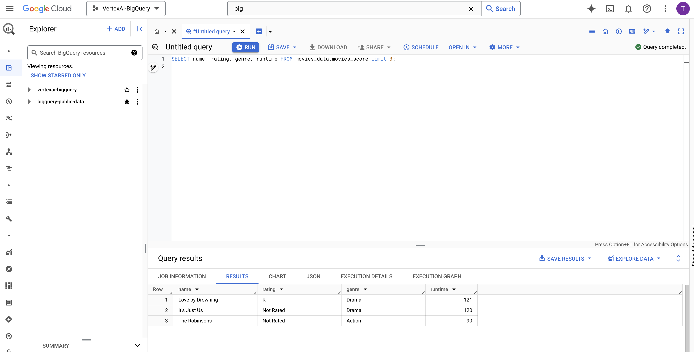

## Using BigQuery data in Vertex AI AutoML

### Creating a Vertex AI Dataset

Go to **Vertex AI** from Google Cloud Console, enable Vertex AI API if not already done, expand the left tab and select **Datasets**, click on **Create data set**, set the **Region** to ```us-central1```.


1. Name the Dataset as ```Movies_Dataset```.
2. Select ```TABULAR``` data type
3. Select ```Regression / classification``` option
4. Click **Create**

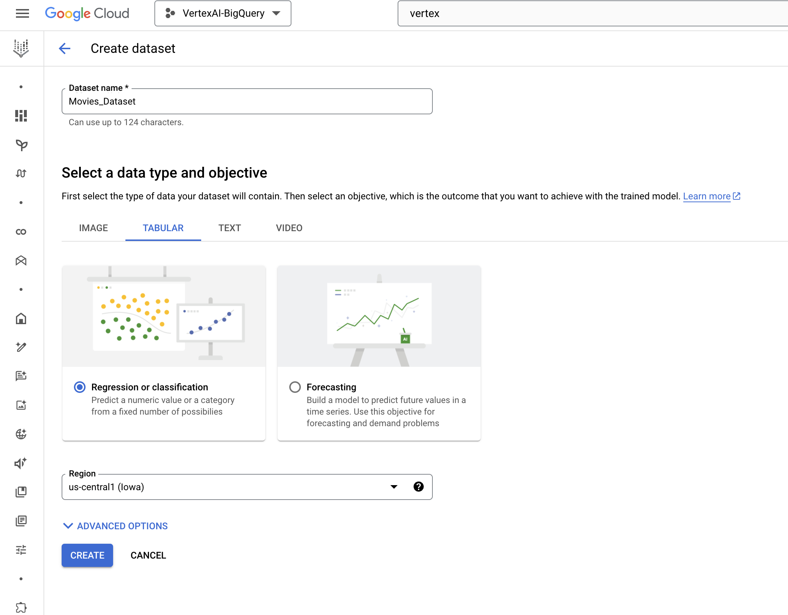

### Select Data Source

On the next page, select a data source. Choose the ```Select a table or view from BigQuery``` option and select the table ```movies_data``` from BigQuery in the BigQuery path **BROWSE** field. Click **Continue**.

Remember: The BigQuery instance and Vertex AI data sets should have the same region in order for the BigQuery table to show up in Vertex AI.

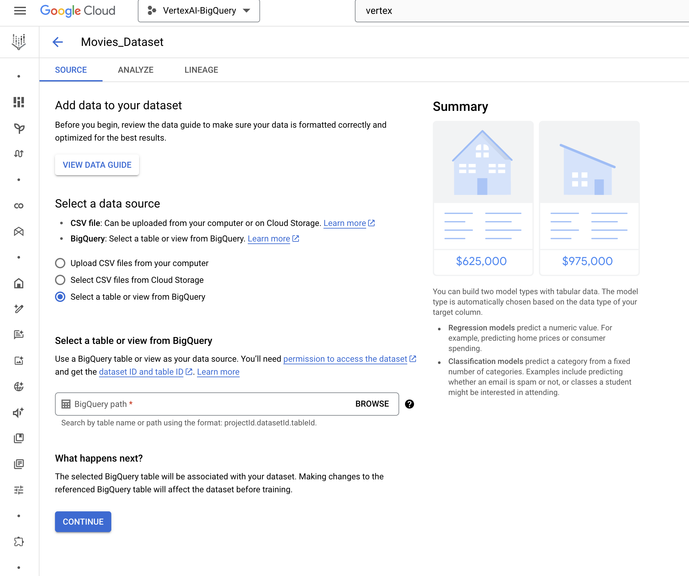

Select the name ```movies_score``` with Dataset: ```movies_data```

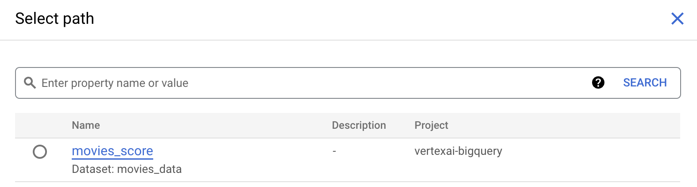

### Train the Model

1.  Once the dataset is created, click on the **Training** tab on the left and click **Train New Model**:

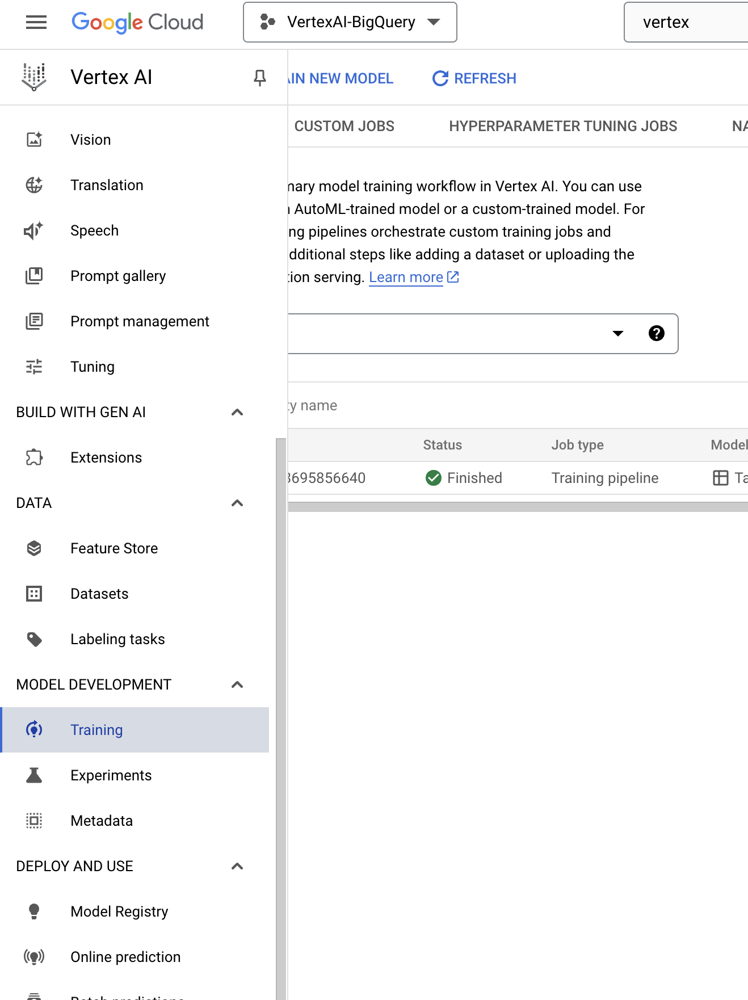

2. Leave Objective as ```Classification``` and select ```AutoML``` option in first page and click **Continue**:

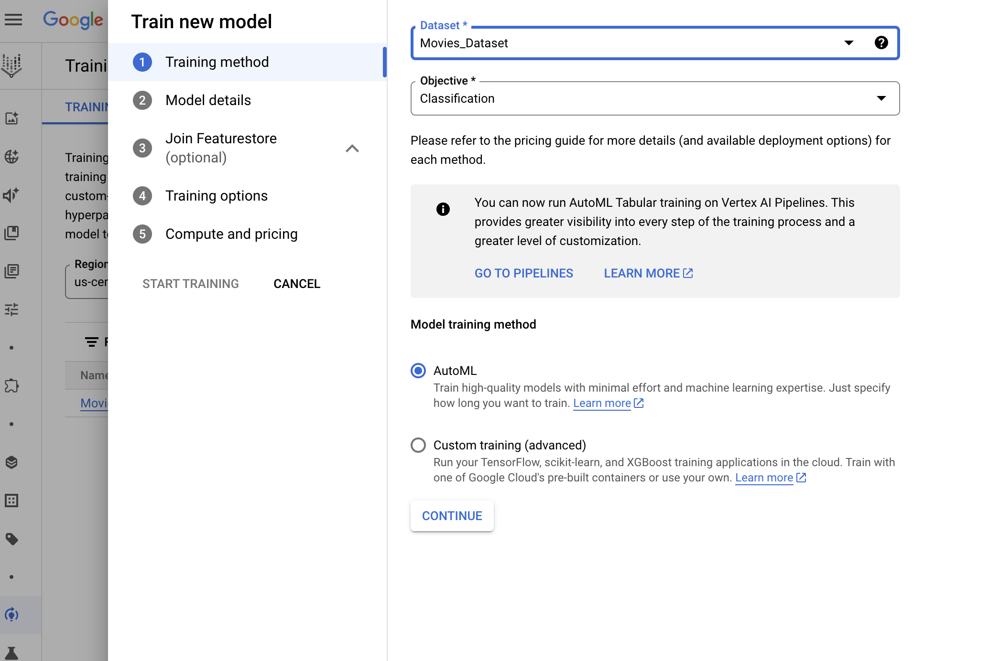

3. Give your model a name and select **Target Column** name as ```Score``` from the dropdown that shows and click **Continue**.


4. Also note that you can check the ```Export test dataset to BigQuery``` option, which makes it easy to see the test set with results in the database efficiently without an extra integration layer or having to move data between services.

5. On the **Join Featurestore** tab with Add features, **skip** and click **Continue to Training** options. This is where if you want to exclude any of your columns from the training you can click the **Minus** button on the right to exclude it. For this lab you can leave all as default and click **Continue**.

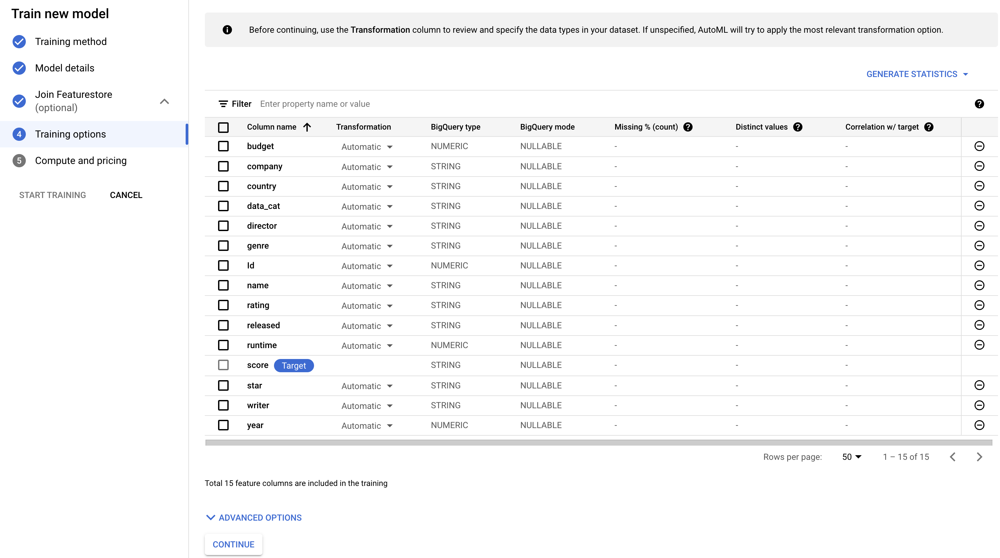

6. On the next page **Compute and Pricing**, you have the option to set the hours you want to set the model to train. Please note that you might want to be mindful of the pricing before you increase the number of node hours you want to use for training. **For this lab input ```1``` for the budget.**

7. Click **Start Training** to begin training your new model.

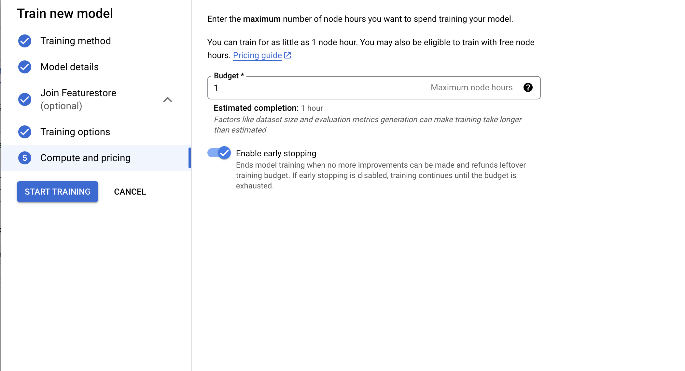

### Evaluate, Deploy and Test the Model

Once the training is completed, you should be able to click **Training** (under the Model Development heading in the left-side menu) and see your training listed in the **Training Pipelines** section. Click that to land on the **Model Registry** page. You should be able to:

1.  View and evaluate the training results
    
2.  Deploy and test the model with your API endpoint


Once you deploy your model, an API endpoint gets created which can be used in your application to send requests and get model prediction results in the response.

As the training can take 1-2hrs, we have already pre trained a model for you to try out deploying a model to an endpoint.

Go to **Model Registry** to access this pre trained model

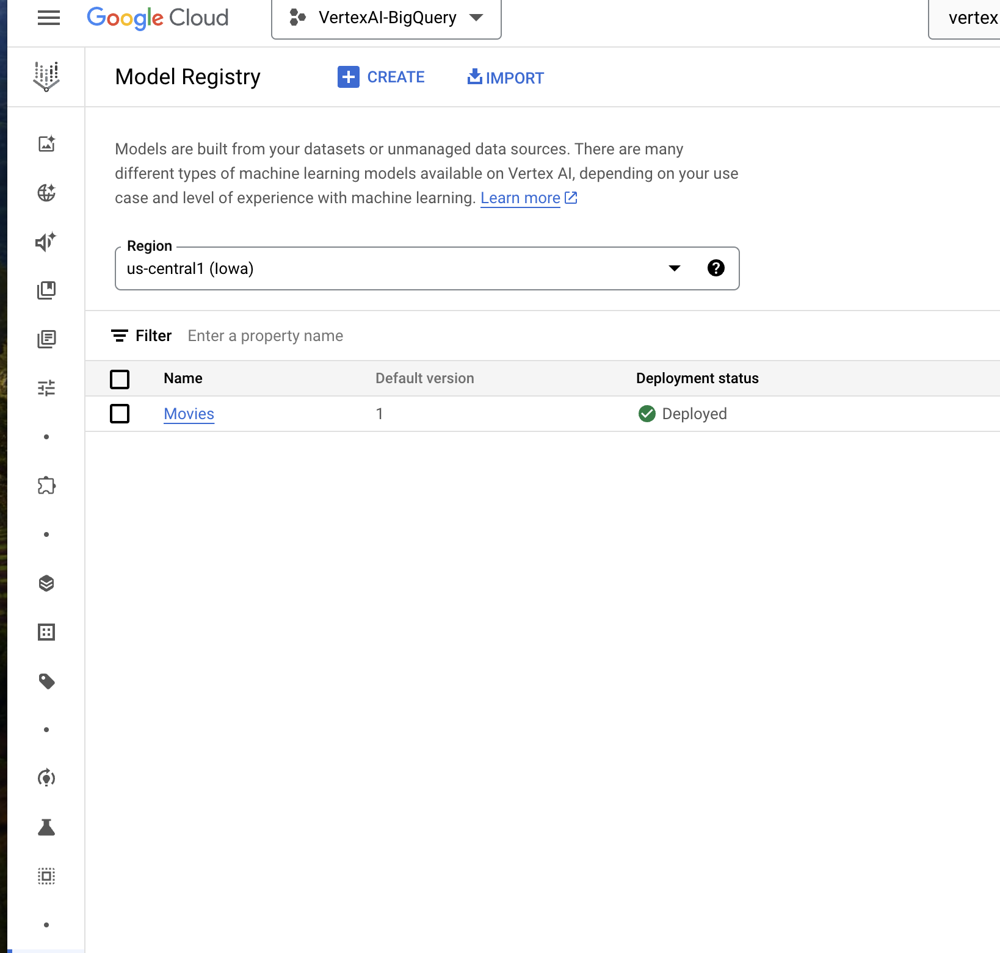

Click on **Movies** model

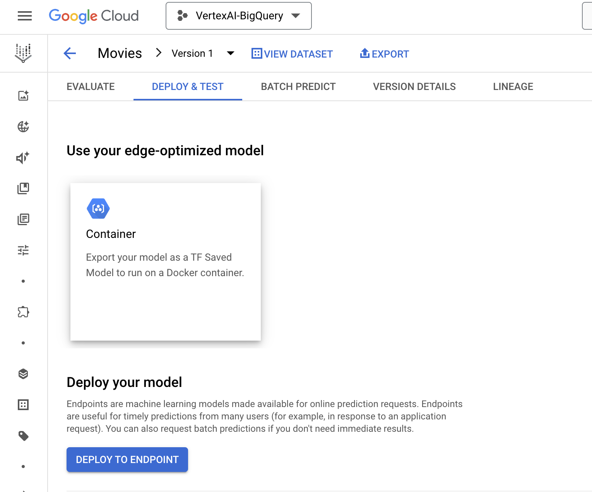

Click **Deploy to Endpoint**

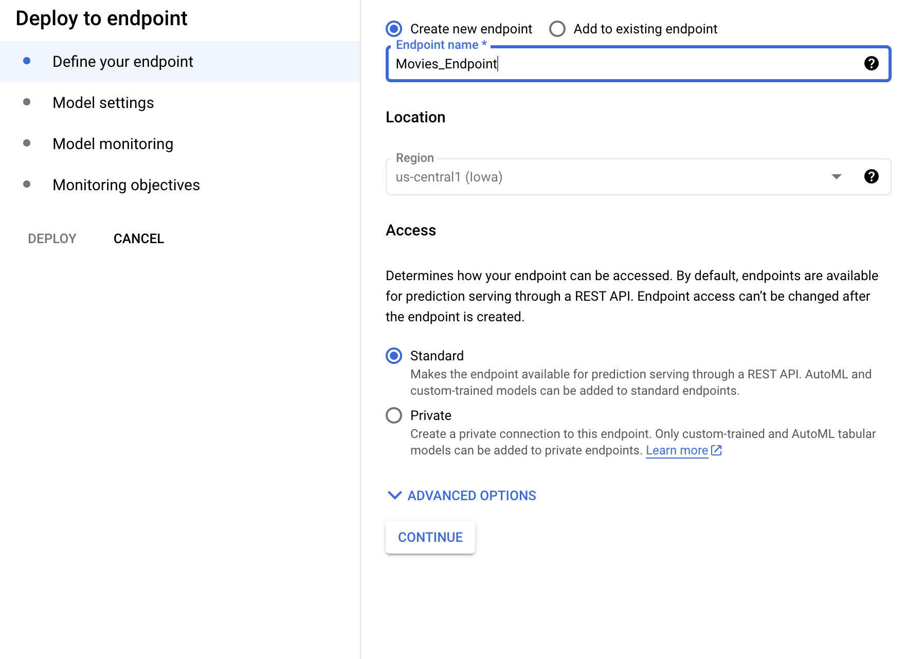

Leave **Model Settings** as the default options :

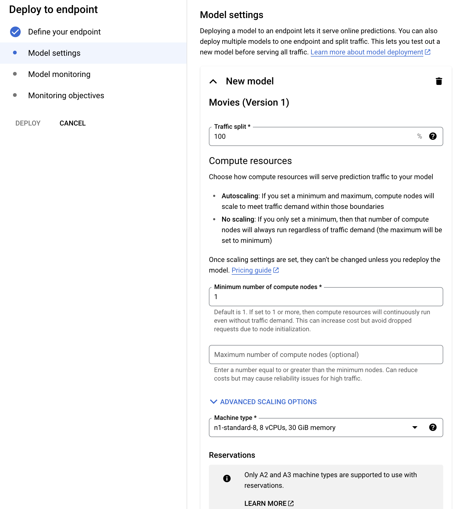

Disable **Model Monitoring** by clicking the radio button that says **Enable model monitoring** for this endpoint

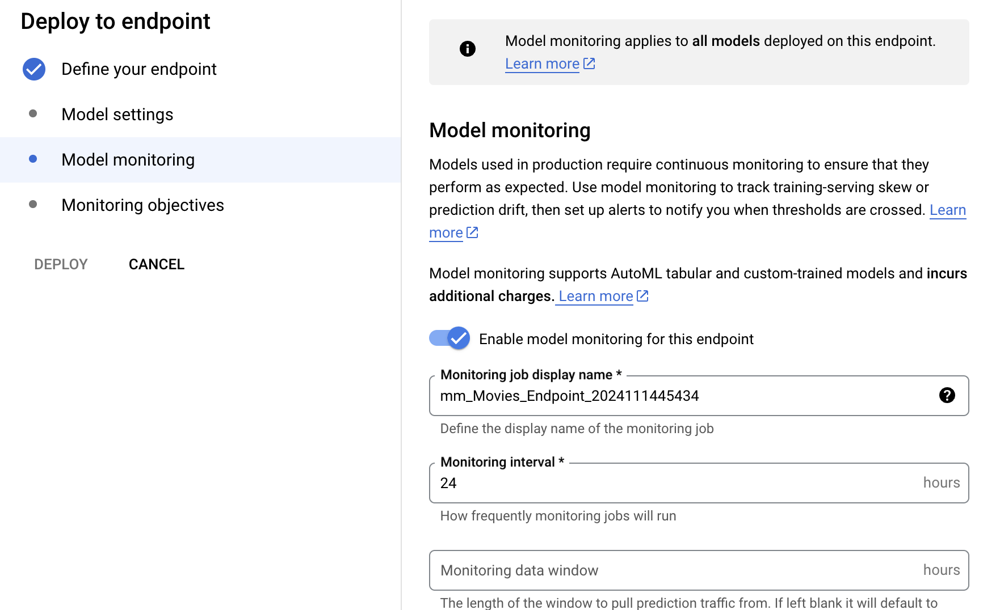

After disabling, you can click **Deploy**

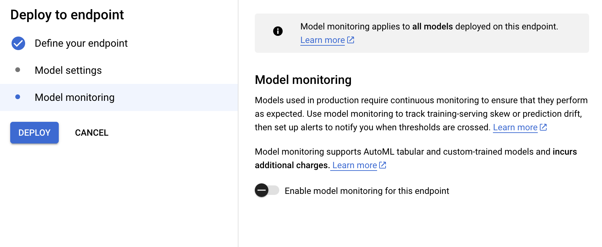

And you have deployed a model!
