# Building AI Agents with Vertex AI Agent Builder

Adapted from: [Building AI Agents with Vertex AI Agent Builder on Codelabs](https://codelabs.developers.google.com/devsite/codelabs/building-ai-agents-vertexai#0)\
Modified by: [Wan Qi Ang](https://github.com/angwanqi) for 2024 EDB x Google Cloud - Cloud AI Take Off Program\
Last updated: 17 November 2024

## Overview
In this lab, you'll learn how to build and deploy generative AI agents using Google Cloud's powerful tools and infrastructure. We'll cover the essential concepts and walk you through the initial steps to get your first agent up and running.

## Before you begin
This self-paced codelab will guide you through building AI Agents with Google Cloud's Vertex AI Agent Builder. Each step will highlight a specific Agent Builder feature and explain its purpose. 
### Prerequisites
- A basic understanding of Generative AI on Google Cloud
- A basic understanding of AI Agent Concepts
### What you’ll learn
- How to create a simple AI Agent using Vertex AI Agent Builder
- How to ground the created agent by attaching a datastore
### What you’ll need
- A curious mind
- A working computer and reliable wifi
- A Google Cloud project with billing attached

## Designing Your First AI Agent
Now you're ready to create your own AI agent. But before diving into development, it's essential to establish a clear vision for your agent. Ask yourself these key questions:
- **What problem will it solve?** Will it automate tasks, provide information, offer entertainment, or facilitate creative exploration?
- **What are its primary functions?** Will it execute tasks or delegate tasks? Will it generate text, or generate a combination of different media?
- **What are its limitations?** Will it be able to do everything autonomously? 
- **What personality or persona should it have?** Will it be formal, informal, humorous, helpful, or informative? 
- **What are the success metrics?** How will you measure the agent's effectiveness?

To speed up the process, here are the answers to those questions for the travel agent you will be creating today:

- **What problem will it solve?**
    - Planning a trip can be time-consuming and overwhelming. This travel agent will help users discover destinations, plan itineraries, book flights and accommodations.
- **What are its primary functions?**
    - The agent should be able to:
        - answer questions about destinations, such as visa requirements
        - plan itineraries that work for users’ schedules and objectives
        - book flights and accommodations
- **What are its limitations?**
    - The agent might not be able to answer complicated queries by default
    - The agent won’t be able to generate visual images
    - The agent’s knowledge will limited by the underlying model
- **What personality or persona should it have?**
    - This agent should be knowledgeable, helpful, and enthusiastic about travel. It should be able to communicate information clearly and concisely.
- **What are the success metrics?**
    - Success for this agent could be measured by how satisfied users are with its recommendations (exploring, planning, booking)

## Building an AI Agent with Vertex AI Agent Builder

With Vertex AI Agent Builder, AI Agents can be created in just a few steps.
### Step 1: Go to Vertex AI Agent Builder
- Open [Vertex AI Agent Builder](https://console.cloud.google.com/gen-app-builder) in a new tab.
- If you see the welcome page (see below), click on the **CONTINUE AND ACTIVATE THE API** button.
- If you don't see it, you can move onto Step 2. 
    
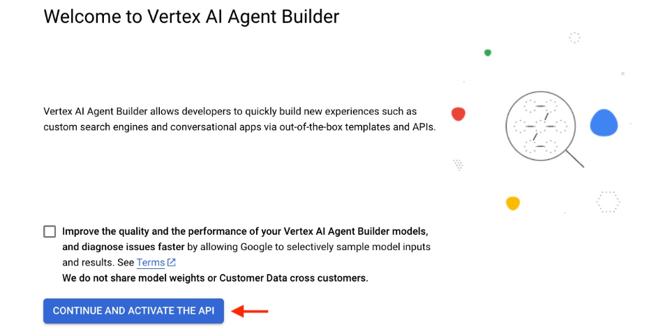

### Step 2: Create an Agent
- You will be redirected to the **App Creation** page. 
- Click on the **CREATE A NEW APP** button.

- Select **Agent** on the next page

- Input a **Display Name** (e.g. John Travel Buddy)
- Select **global** as Region.
- Click on **CREATE**.

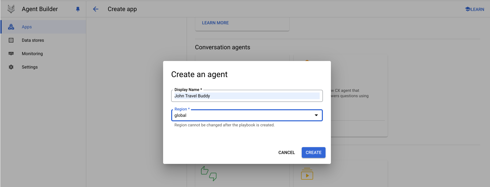

### Step 3: Let's start building your agent!
- Pick an Agent Name
    - Example: Info Agent
- Add a Goal
    - Example: Help customers answer travel related queries
- Define an Instruction
    - Example: - Greet the users, then ask how you can help them today
- Press **Save** once everything is finalized

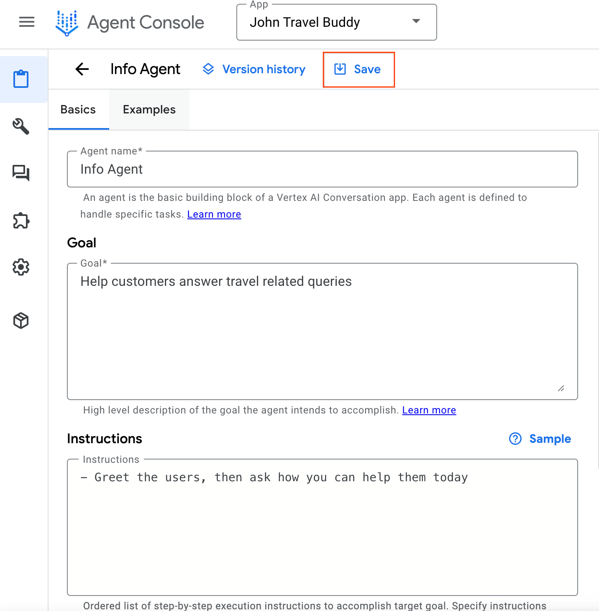

- And there you have it - your first agent!

### Step 4: Let's try chatting with your newly created agent
- Select the agent that you just created (e.g. Info Agent)
- Choose the underlying generative AI model for your agent
    - **Example:** gemini-1.5-flash-002
- Test your agent by having a conversation with it
    - **Example:** Hello how are you doing?

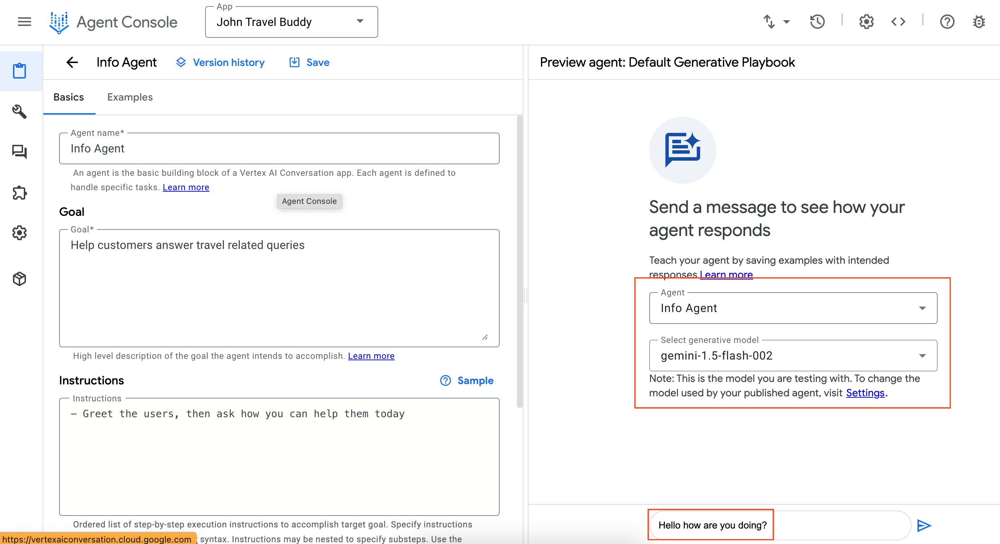

Congratulations! You just successfully created an AI Agent using Vertex AI Agent Builder. 

## Attaching Datastores to the Agent
Try asking your agent about getting to Wakanda:
> E.g. “What’s the best way to reach Wakanda?”

You will get a response like this:
> I'm sorry, I can't provide information about Wakanda. It is a fictional country from the Marvel Universe

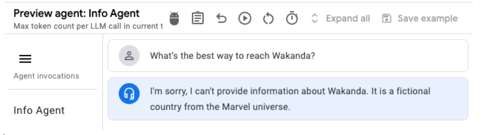

While this is factually correct, instead of simply stating **"I can't provide information"** and ending the conversation, it would be more helpful to the user if the agent suggested similar places. This approach could potentially lead to users actually booking a trip through the agent.

In order for the agent to recommend similar places, you can provide more information to the agent through **Datastores**. It acts as an additional knowledge base for the agent to refer to if the agent is not able to answer user questions based on their built-in knowledge.

### Let's create a datastore
- Creating a datastore is straight-forward
- Click on **+ Data store** button at the bottom of your Agent page.
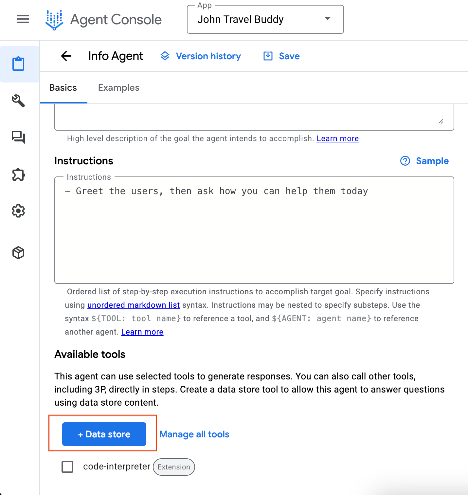
- Fill up the following information:
    - **Tool name:** Alternative Location
    - **Type:** Data store
    - **Description:** Use this tool if user's request contains a location that doesn't exist
- Cick **Save** when you are done
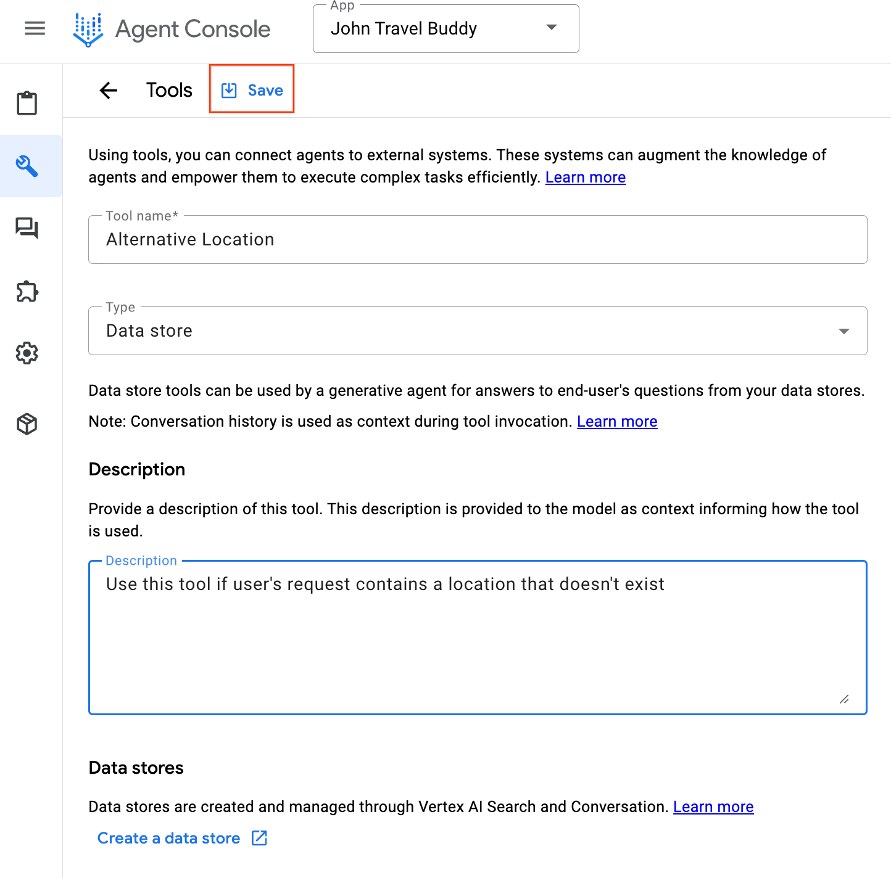

This creates a datastore tool for the agent to communicate with the datastore, but you still need to create an actual datastore that contains the information.

- To do that, click on **Create a data store** at the bottom
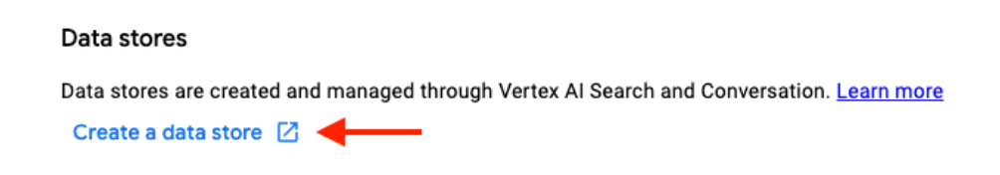
- Fill up the **Company name field**
    - Example: Travel Wise
- Click on **CONTINUE**.
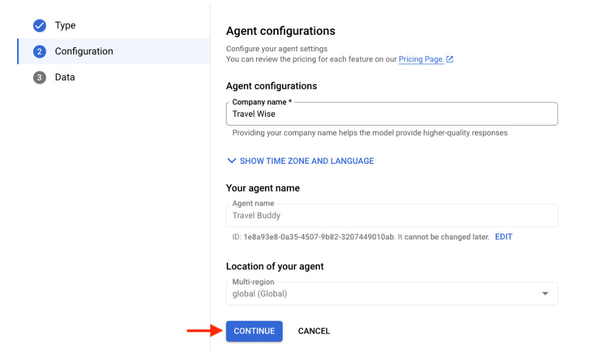
- Click on **CREATE DATA STORE**
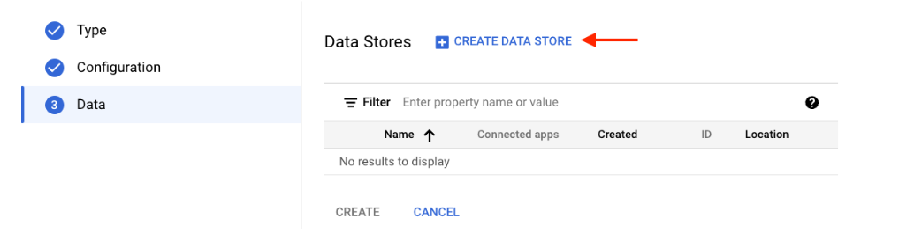
- Select **Cloud Storage.**
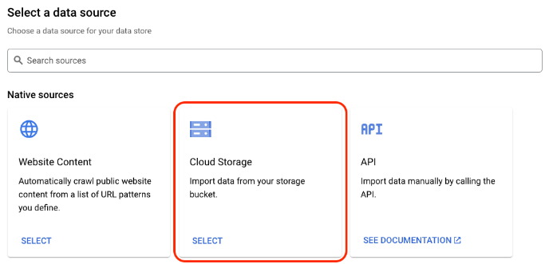
- Select **Unstructured documents (PDF, HTML, TXT and more)**
- Click on **FILE** and paste this bucket path: ai-workshops/agents/data/wakanda.txt
- Click on **CONTINUE**

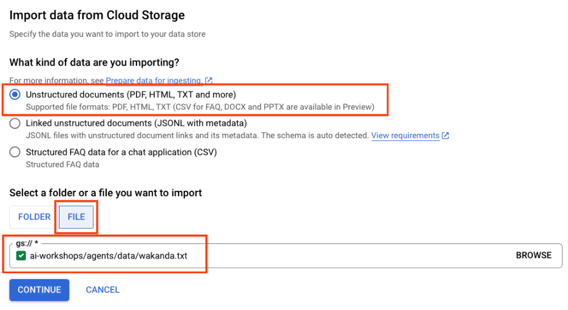

If you are curious, here is the content of the provided text file:

> **Places that are similar to Wakanda**
>
> - Oribi Gorge in South Africa: The rock formations here are reminiscent of the Warrior Falls in Wakanda.
> - Iguazu Falls: Located on the border of Argentina and Brazil, these massive waterfalls were a major inspiration for the Warrior Falls.
> - Immerse yourself in Wakandan culture: Read the Black Panther comics, watch the movies, and explore online resources to learn more about Wakandan culture, language, and technology.
> - Visit a Disney theme park: While there isn't a dedicated Wakanda land yet, you might be able to meet Black Panther at Disneyland or on a Marvel Day at Sea Disney cruise.

- Next, name your datastore
    - Example: Wakanda Alternative
- Click **CREATE**.
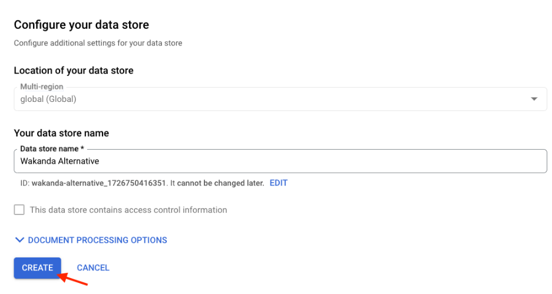
- Finally, select the data source that you just created and click on **CREATE**.
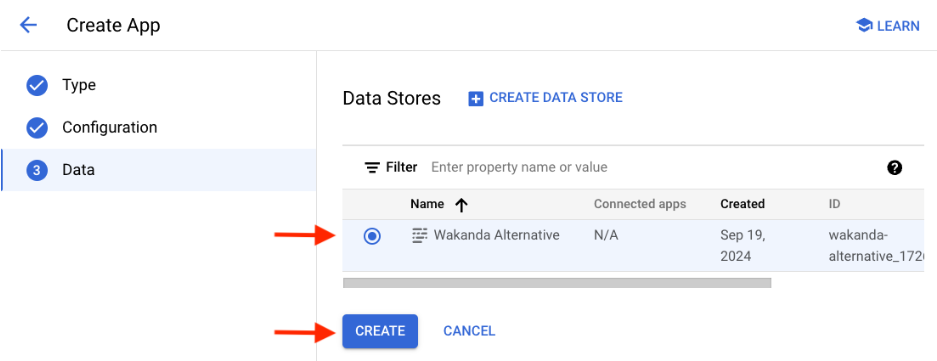
- If everything went smoothly, you should see the datastore created under the Available data stores page.
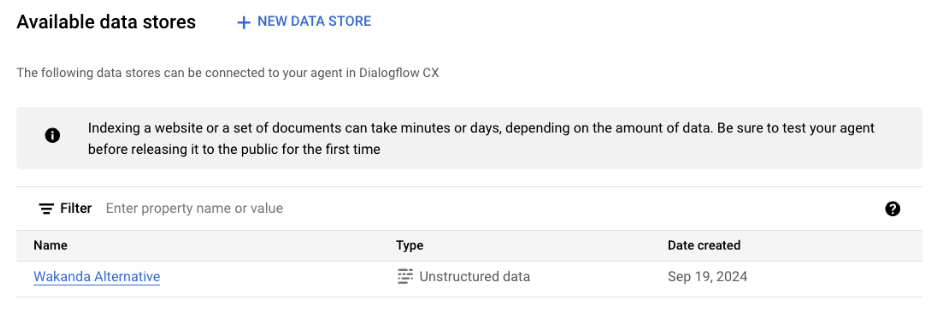

The datastore will take a few minutes to ingest the data so give it some time...

### Let's check on our datastore
- Head back to your **Agent** page
- Click on **Manage all tools**
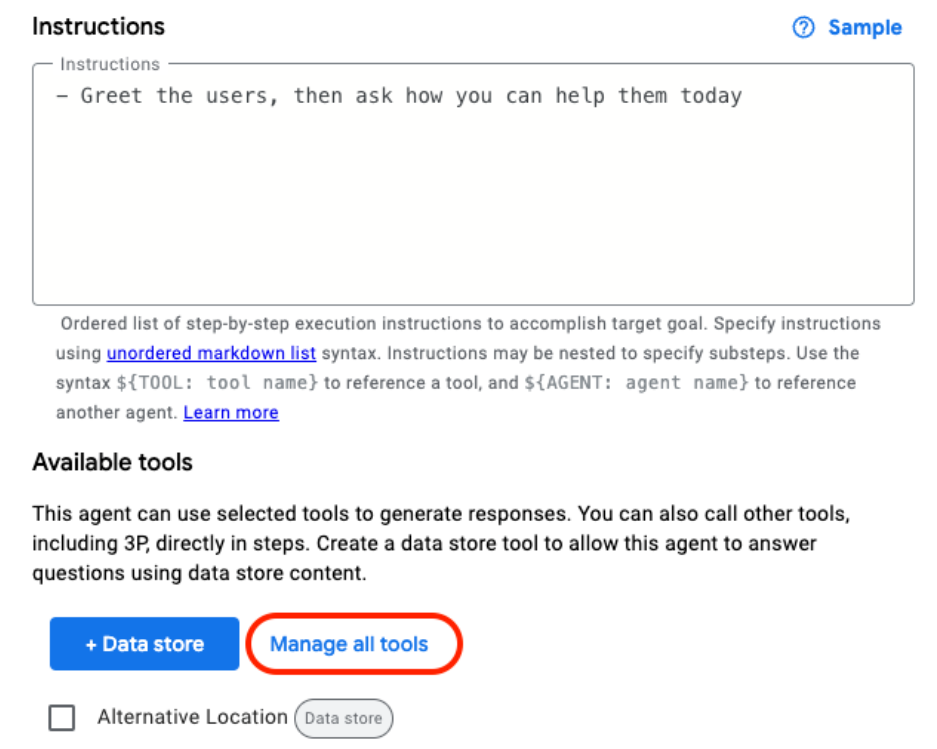
- Click on the **Data Store** that you created previously.
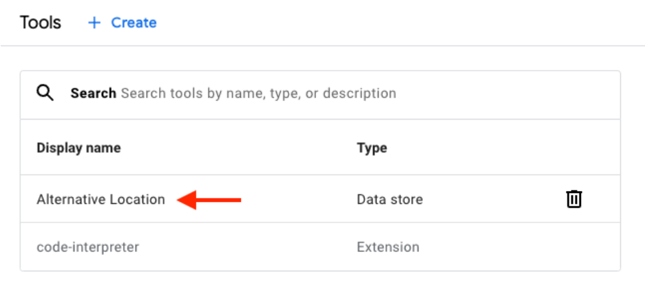

There will be new settings under the **Data stores** section. If you are not able to see these new settings right away, it means that datastore is still ingesting the data from Google Cloud Storage. It should be done in less than 5 minutes.

- Choose the data store that you want to link up (e.g. Wakanda Alternative)
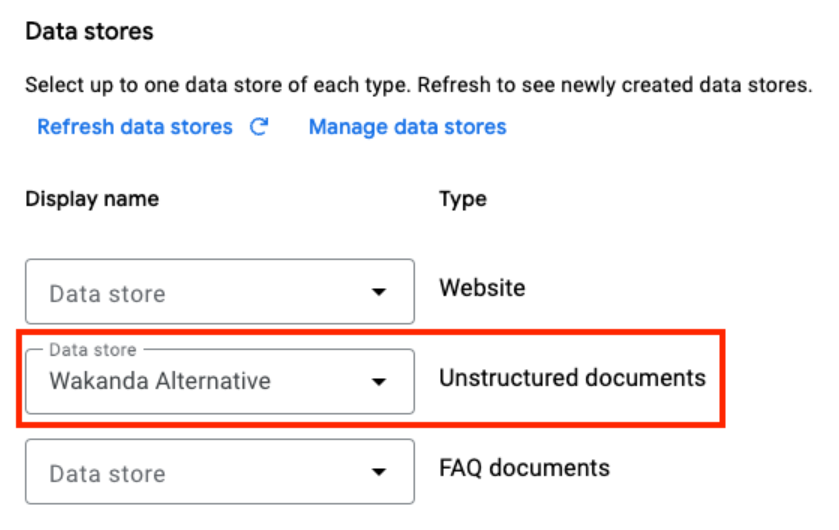

- In order to prevent Agent from hallucinations, set the setting to **Very Low** which applies tighter restrictions on Agent from making things up.
- Click on **Save** button at the top of the page, once you are done with the edits.
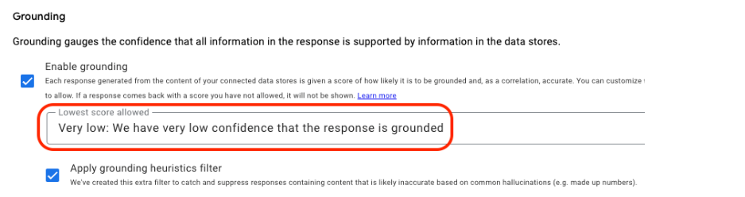

- Head back to the Agent page again, check the **Data Store (e.g. Alternative Location)**, and click on **Save** button at top of the page.
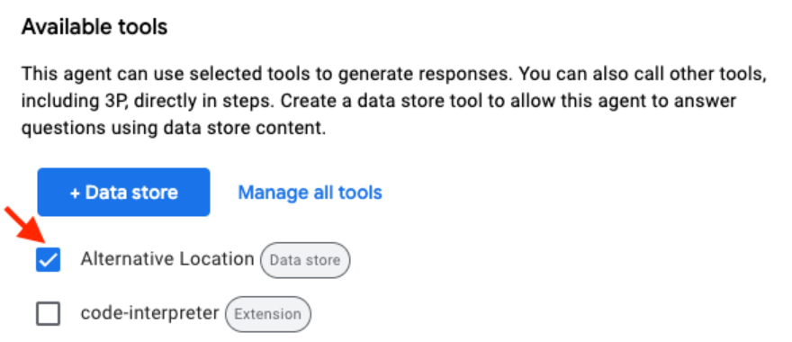

You are almost there! The final step is to include the "Alternative Location" tool in the agent's instructions. 
- Add a line under instructions
    - \- Use ${TOOL: Alternative Location} if the user's request contains a location that does not exist, to the agent's instructions.

- After saving the agent, try asking your agent about getting to Wakanda
> Example: What’s the best way to reach Wakanda?

Again, you will get a different response like this:
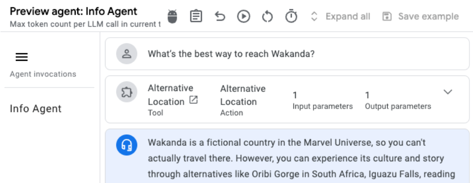

Congratulations! Your agent is now recommending places using the provided information from the text file.

## Delegating tasks to another Agent
To be added

