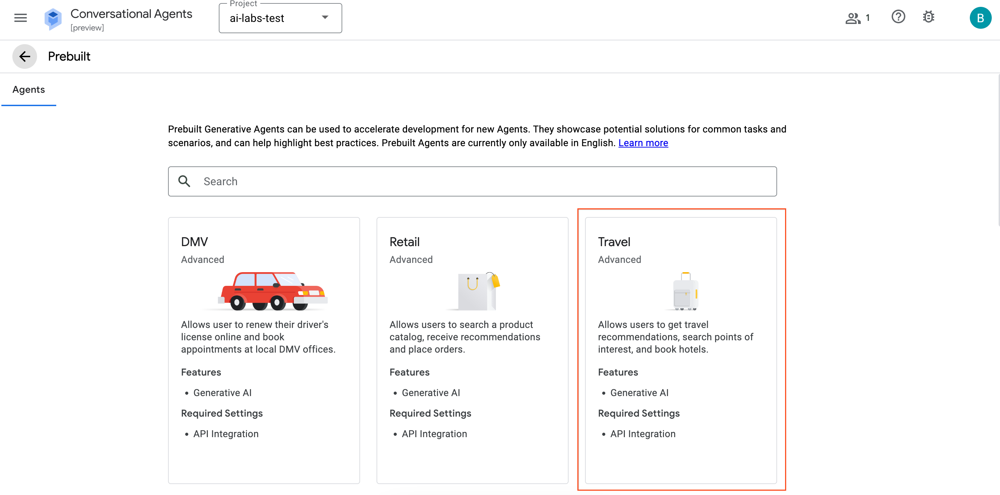
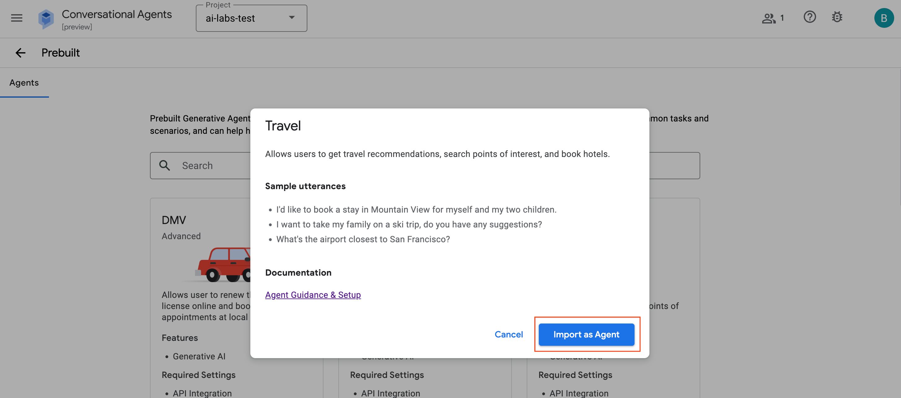
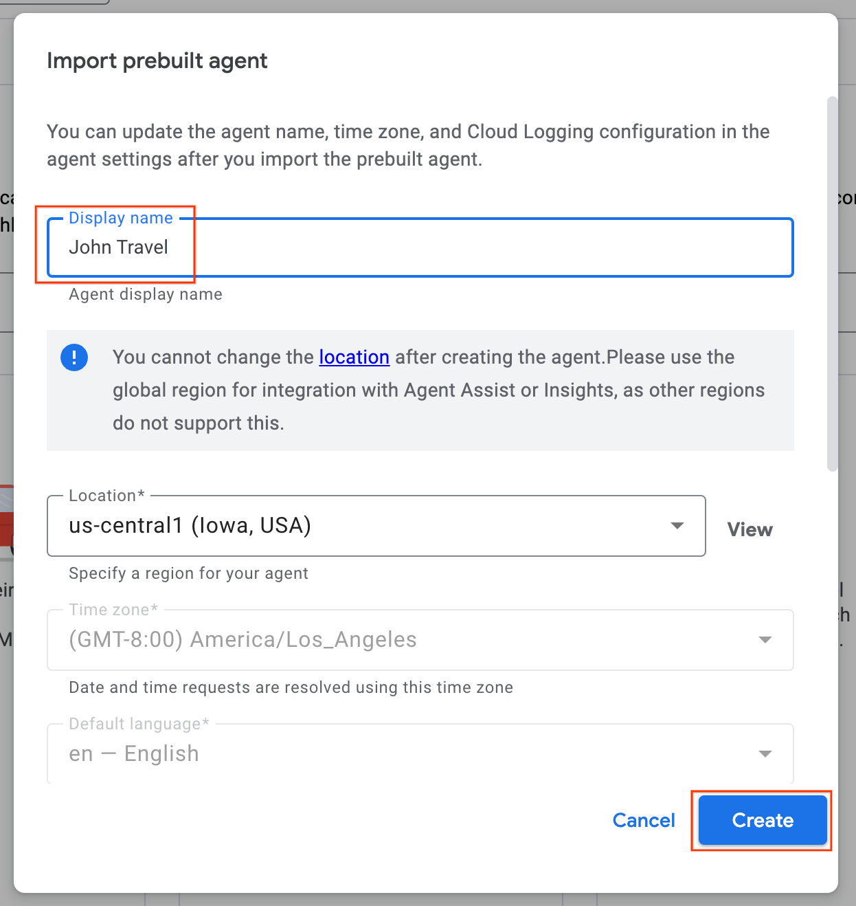
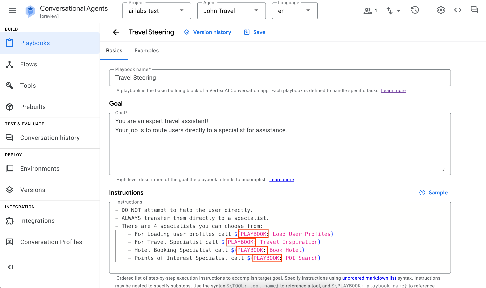
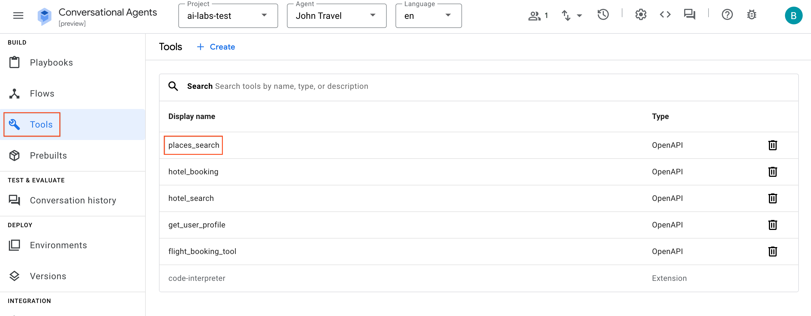
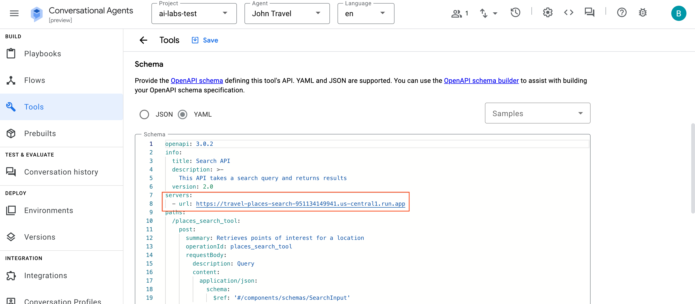
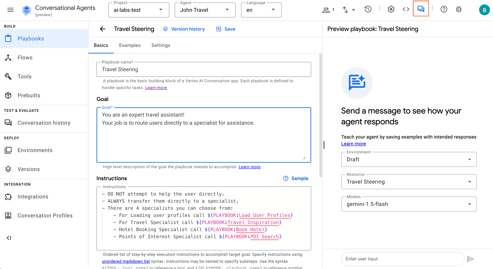
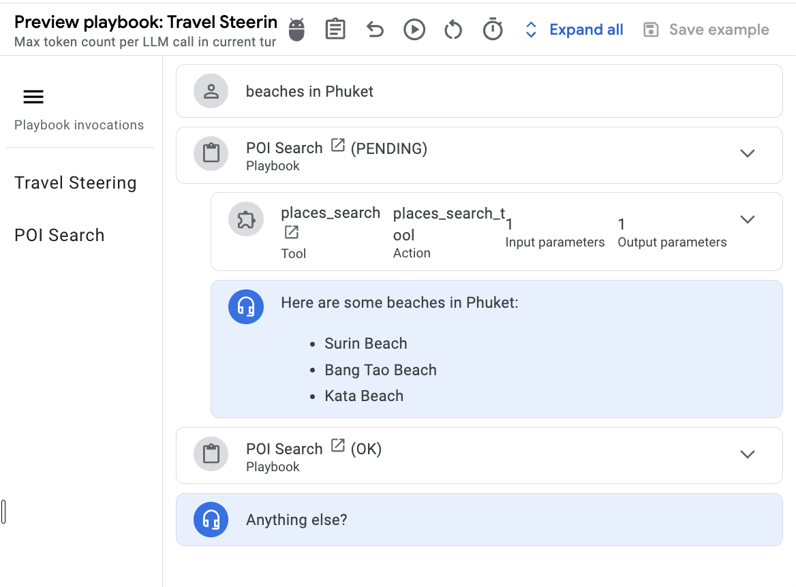

# Building AI Agents with Vertex AI Agent Builder

## Overview
In this lab, you'll learn how to build and deploy generative AI agents using Google Cloud's powerful tools and infrastructure. We'll cover the essential concepts and walk you through the initial steps to get your first agent up and running.

## Building an AI Agent with Vertex AI Agent Builder

With Vertex AI Agent Builder, AI Agents can be created in just a few steps. For today's lab, we will be importing a Pre-Built Agent so that you can see how it works and play around with it
### Step 1: Go to Vertex AI Agent Builder
- Open a new tab and copy the URL below (Replace ```<PROJECT_ID>``` with your Project ID:

```
https://dialogflow.cloud.google.com/v2/projects/<PROJECT_ID>/prebuilt
```

- In the next page (shown below), select the **Travel** agent



- Click on **Import Agent**


- For the settings, give your Agent a name **(e.g. John Travel)**
- Leave everything else as default and click on **Create**


- Once created, click into the **Travel Steering** playbook
- Under **Instructions**, ensure that the phrases are replaced with **PLAYBOOK** (see red boxes in screenshot below)


- Next, in the left panel click on **Tools**
- Click into **places_search** tool.


- Scroll down to **Schema**
- Under Server URL, replace the URL with:
```bash
https://travel-places-search-951134149941.us-central1.run.app
```
- Once done, click **Save**


- Repeat this for the other tools - remember to always click **Save** after you edit!
  
| Tool Name         | URL |
| :---------------- | :------ |
| places_search     | https://travel-places-search-951134149941.us-central1.run.app    |
| hotel_booking     | https://travel-book-hotel-951134149941.us-central1.run.app       |
| hotel_search      | https://travel-places-search-951134149941.us-central1.run.app    |
| get_user_profile  | https://travel-get-user-profile-951134149941.us-central1.run.app |

- Once you're done, you are ready to test your travel agent! 
- Head back to Playbooks and select **Travel Steering**
- Click on the **Chat** icon at the top to toggle open the simulator


### Ask away!
You can ask for recommendations, more information about certain places and also try to get it to book a hotel for you (of course it'll be a simulated booking, not an actual one!)
- Here are some as starters:
    - Beach vacation in Phuket
    - Hotels near the beach in Phuket
    - Hotels in Sentosa

For example: When asking about certain places you should be able to see that the ```places_search``` tool gets triggered to do a Google Maps API call and retrieve places related to your query. And that's how you get your agent to interact with other systems to enrich it.




